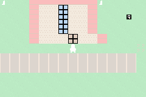

# Pocket Walker

A very small Game Boy Advance homebrew: a top-down overworld walker in the
style of *Pokemon Red/Blue* — **without battles**. You walk a little trainer
around Pocket Town, read signs with A, check your berry count with START,
and go inside the house.

Built from scratch as bare-metal C (no libgba, no BIOS calls): Mode 0 with
one 64x64 tile background and one 16x16 sprite, 4bpp graphics generated
from ASCII art at build time.



## Controls

| Button | Action |
|--------|--------|
| D-pad  | Walk (4 directions, with walk animation) |
| A      | Read signs / enter or exit the house |
| START  | Berry counter |
| B      | (nothing yet) |

The goal is simply to explore: 6 red berries are hidden on the map — walk
over them to collect. Signs give hints; the house has an interior.

## Build

You need an ARM EABI toolchain (`arm-none-eabi-gcc`, e.g. the xPack GNU Arm
Embedded GCC or devkitARM). Point `TOOLCHAIN` at the install dir:

```sh
make TOOLCHAIN=/path/to/toolchain   # produces pocket-walker.gba
make deploy                         # also copies it to ../../assets/games/
make test                           # headless automated test (see below)
```

The Makefile runs two small Python generators first:

- `tools/gen_header.py` → `src/header_inc.s` (GBA ROM header: entry branch,
  Nintendo logo, title, checksum)
- `tools/gfx.py` → `src/gfx_data.{h,c}` + `src/map_data.h` (palettes,
  tileset, font, hero frames, maps — all from ASCII art)

## Project layout

```
art/          ASCII-art sources: tiles.txt, hero.txt, font.txt, maps.txt
tools/        gfx.py + gen_header.py generators, test_game.py + .sh harness
src/          crt0.s (startup + header), gba.h (registers), main.c (game)
linker.ld     ROM / IWRAM memory layout
pocket-walker.gba   build output
```

### Editing the graphics

Everything is plain ASCII art — edit the files in `art/` and rebuild:

- `art/tiles.txt` — 8x8 background tiles (`[name]` + 8 rows of 8 chars;
  legend in the file header maps chars to palette colors)
- `art/hero.txt` — 16x16 hero frames: down/up/left/right x walk frames
- `art/font.txt` — 5x7 font glyphs
- `art/maps.txt` — 32x32 cell maps (each cell expands to 2x2 tiles);
  the town must contain exactly 6 `B` (berry) cells

## How it works (the fun bits)

- **Camera**: the world is 64x64 tiles (512x512 px); the camera follows the
  player and clamps at the world edge. `BG0HOFS/VOFS` are write-only on real
  hardware, so the camera position is kept in RAM.
- **Dialog box**: the Pokemon-style text box is stamped directly into the
  BG0 tilemap at the bottom 5 tile rows (the tiles underneath are saved and
  restored). While a dialog is open, movement is frozen and the hero's OBJ
  priority is lowered so the box covers him.
- **64x64 map quirk**: the GBA stores a 64x64 map as four 32x32 quadrant
  screenblocks; `upload_map()` converts the plain row-major map to that
  layout.
- **Collision**: 1px-per-frame movement with leading-edge tile checks
  (avoids corner-snagging); trees, water, walls, signs and doors are solid.
- **Multiboot trap**: mGBA classifies a ROM as "multiboot" if its startup
  code references EWRAM addresses (0x02xxxxxx). All BSS lives in IWRAM so
  the ROM is always treated as a normal cartridge ROM.

## Testing

`make test` runs a headless automated playthrough with the mGBA Python
bindings: it boots the ROM, dismisses the intro, walks the hero around,
collects a berry, opens the status screen, enters/exits the house and reads
a sign — then saves screenshots to `build/shots/`. The game state struct
sits at IWRAM 0x03000000 specifically so the harness can assert on it.

The harness needs `python3` with the `mgba` module
(`MGBA_PYTHON` env var points at the `mgba` package directory) and, if
libmgba was built without FFmpeg, the eReader stub in `/tmp/ereader_stubs.so`
(see `tools/test_game.sh`).
